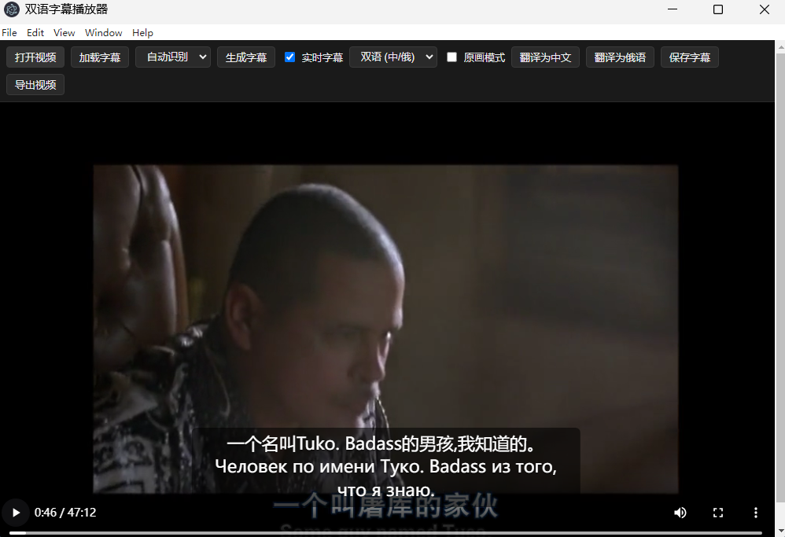

# 播放器 · BofangQi

> 一个带「实时中俄字幕」的本地视频播放器 —— 离线、免代理、开箱即用。
> A local video player with **real-time Chinese / Russian subtitles** — offline, no proxy, ready to use.

<p align="center">
  
  
  
  
  
</p>

## 这是什么？/ TL;DR

**打开本地视频 → 自动把里面的话识别成文字 → 实时翻译成中文或俄文字幕。** 全程在你自己电脑上完成，不开代理、不上传视频、不花钱。

**Open a local video → it transcribes the speech → and shows real-time Chinese/Russian subtitles.** Everything runs on your own machine — no VPN, nothing uploaded, free.

```
🎞️ 视频音频 ──► 🗣️ faster-whisper ──► 📝 原文文本 ──► 🌏 M2M100 ──► 💬 中/俄字幕
   audio          speech-to-text         text          translate       subtitles
```

> 适合：看没有中俄字幕的片源、外语学习、给家人朋友配字幕。
> Good for: foreign videos without CN/RU subtitles, language learning, captioning for friends & family.

## 📸 截图 / Screenshot

<p align="center">
  
</p>

<p align="center"><sub>播放时实时叠加中文 + 俄文双语字幕 · real-time Chinese + Russian subtitles overlaid during playback</sub></p>

---

## 缘起 / Why this exists

最初做这个，纯粹是为了我自己和女朋友。我们平时一起看视频，常常碰到**没有中文或俄语字幕**的片源，看得很费劲。市面上的工具要么要联网开代理、要么收费、要么把视频上传到别人服务器，都不太合适。于是干脆自己写了这个播放器：**在本地把语音识别成文字、再翻译成中文/俄文字幕**，全程不需要代理，也不会把视频传到任何地方。

目前最大的缺点是**识别和翻译的精度还不够高**（CPU + 轻量模型，为了能实时跑做了取舍）。后续我会不断优化，但更新**可能不定期**——这是个业余时间维护的小项目，随缘更新，敬请见谅 🙂

> I originally built this just for me and my girlfriend. We watch videos together a lot and kept running into sources with **no Chinese or Russian subtitles**. Existing tools either needed a VPN/proxy, cost money, or uploaded your video to someone else's server. So I wrote my own player that **transcribes the audio and translates it into Chinese/Russian subtitles entirely on your own machine** — no proxy, nothing uploaded.
>
> The main weakness right now is that **recognition and translation accuracy is still not great** (CPU + lightweight models, traded off to keep it real-time). I'll keep improving it, but updates may be **irregular** — it's a small side project maintained in spare time. Thanks for your understanding 🙂

---

## ✨ 功能 / Features

- 🎬 本地视频播放（mp4 / mkv / mov / webm / avi / ts 等）/ Local video playback
- 🗣️ **实时语音转字幕**：基于 [faster-whisper](https://github.com/SYSTRAN/faster-whisper)，边播边识别 / Real-time speech-to-subtitle
- 🌏 **实时翻译**：英 ⇄ 中 ⇄ 俄，基于 Meta [M2M100](https://huggingface.co/facebook/m2m100_418M) / Real-time translation (EN ⇄ ZH ⇄ RU)
- 🧽 **去原片硬字幕**：盖住/去除原片烧录在画面上的字幕，再叠加自己的实时翻译 / Remove burned-in original subtitles, then overlay your own translation
- 📂 加载外挂字幕（.srt / .vtt）/ Load external subtitles
- 💾 导出带硬字幕的视频（FFmpeg 内嵌，无需另装）/ Export video with burned-in subtitles
- 🚫 **免代理、可离线**：使用 [hf-mirror.com](https://hf-mirror.com) 国内镜像下载模型，运行时强制直连 / No proxy, offline-capable

## 🧩 技术栈 / Tech stack

| 部分 / Part | 用的什么 / What |
| --- | --- |
| 界面 / UI | Electron |
| 语音识别 / ASR | faster-whisper（tiny / base / small / medium）|
| 机器翻译 / MT | M2M100 418M（默认实时）/ 1.2B（可选高精度）+ Helsinki-NLP MarianMT 兜底 |
| 音视频 / Media | FFmpeg（`ffmpeg-static` 内置）|
| 模型下载 / Models | HuggingFace + hf-mirror 镜像 |

---

## 🚀 安装与运行 / Install & Run

### 1. 前置环境 / Prerequisites

- **Node.js** 18+（用于 Electron）
- **Python** 3.8+（用于识别与翻译服务）
- FFmpeg 已通过 `ffmpeg-static` 内置，**无需单独安装** / bundled, no separate install needed

### 2. 安装依赖 / Install dependencies

```bash
# 前端依赖 / frontend
npm install

# Python 依赖 / Python
pip install -r requirements.txt
```

### 3. 下载模型 / Download models（首次必做 / required on first run）

模型不随仓库分发（太大，约数 GB）。运行下面的脚本，会自动**通过国内镜像下载并转换为 safetensors**，全程免代理：

Models are not shipped in the repo (several GB). The script below downloads them **via the China mirror and converts them to safetensors**, no proxy required:

```bash
python scripts/download_models.py
```

> 默认下载实时翻译模型 `m2m100_418M` + `faster-whisper-small/medium`，并可选 `m2m100_1.2B`。
> Downloads `m2m100_418M` (real-time) + `faster-whisper-small/medium`, optionally `m2m100_1.2B`.

### 4. 启动 / Start

```bash
npm start
```

Windows 下也可直接双击 `start.bat`。/ On Windows you can also double-click `start.bat`.

---

## 🎛️ 使用 / Usage

1. 打开应用 → **打开视频** 选择本地文件 / Open the app → **Open Video**
2. 勾选 **实时字幕**，选择目标语言（中 / 俄 / 英）/ Enable **Live subtitles**, pick target language
3. 想要离线高质量字幕，可先**生成整片字幕**再播放 / For higher quality, **generate full subtitles** first
4. 也可**加载外挂字幕**或**导出带字幕的视频** / Or **load external subtitles** / **export burned-in video**

### 🧽 去原片硬字幕 / Remove burned-in subtitles

原片画面上烧死的字幕会和你的实时翻译打架。勾选工具栏 **「去原片字幕」** 即可，两档共用同一个遮罩区域：

Burned-in subtitles clash with your own translation. Tick **「去原片字幕」** in the toolbar — both modes share the same region:

1. **播放时（实时、零重编码）**：画面上出现一个遮罩框，**拖动移动、右下角缩放**对准原片字幕条；该区域会被模糊压暗，原字幕看不清，你的实时翻译照常叠在上面。
   *Live playback (real-time, no re-encode): drag/resize the box over the original subtitle band; it gets blurred & darkened while your translation overlays on top.*
2. **导出·快速去除（FFmpeg delogo）**：点 **导出视频**，用 FFmpeg `delogo` 在同一区域逐帧像素插值去除，并烧录双语译文。快，但复杂背景上会有模糊感。
   *Export, fast (FFmpeg delogo): quick per-frame interpolation + burn-in subtitles.*
3. **去字幕·商业级（GPU·STTN）**：点 **去字幕(GPU)**，用 **STTN 时序视频补全**——参考相邻帧把字幕背后的画面真正"重建"回来，时序连贯、不闪、效果接近商用工具。处理完自动载入干净视频，你再叠实时翻译即可。
   *Remove, commercial-grade (GPU·STTN): true temporal video inpainting that reconstructs the background behind subtitles from neighboring frames.*

> 三个层次：实时遮罩=视觉遮挡（最快）；delogo=像素插值（快、一般）；**STTN=深度时序补全（最好，需 NVIDIA GPU）**。
> Three tiers: live mask (hide) → delogo (interpolate) → **STTN (deep temporal inpaint, best, needs NVIDIA GPU)**.

**STTN 去字幕说明 / Notes:**
- 需要 **NVIDIA GPU + CUDA 版 PyTorch**（CPU 也能跑但很慢）；依赖 `opencv-python`、`torchvision`。
- 首次使用会自动下载 STTN 权重（约 66MB，GitHub 直连，免代理）到 `models_cache/sttn/sttn.pth`。
- 离线批处理 + 重编码，会保留原音轨；速度约每分钟视频数十秒级（取决于分辨率与显卡）。
- 蓝框对准字幕条即可；默认按"亮文字"自动生成笔画级 mask，只挖文字、保留背景。
- *Needs an NVIDIA GPU + CUDA PyTorch; weights (~66MB) auto-download on first run; offline + re-encode, audio preserved.*

### 精度 / 速度切换 / Quality vs. speed

| 模式 / Mode | 翻译模型 / MT model | 说明 / Notes |
| --- | --- | --- |
| 默认 / Default | m2m100 **418M** | CPU 上约 0.2~0.5 秒/句，适合实时 / fast, real-time |
| 高精度 / High | m2m100 **1.2B** | 设置环境变量 `MODEL_PRECISION=ultra`；质量更高但 CPU 较慢、约 6.5GB 内存 / set `MODEL_PRECISION=ultra`; better but slower |

### 🎚️ 进阶调优 / Advanced tuning（环境变量 + 术语表）

通过环境变量切换识别精度、用术语表修正专有名词，**无需改代码**：

Switch ASR accuracy via env vars and fix proper nouns with a glossary — **no code changes needed**:

| 变量 / Env | 作用 / What it does | 默认 / Default |
| --- | --- | --- |
| `WHISPER_MODEL` | 识别模型大小 `tiny/base/small/medium`，越大越准、越慢；缺模型会自动回退 / ASR model size, auto-falls back if missing | 实时 `small` / 整片 `base` |
| `WHISPER_COMPUTE` | 计算精度 `int8`（最快）/`int8_float32`/`float32`（更准）/ compute type | `int8` |
| `WHISPER_CPU_THREADS` | 推理线程数，默认取物理核估算值（多核更快）/ inference threads (auto by cores) | 自动 / auto |
| `WHISPER_BATCH_SIZE` | **整片转写批量大小**，调大可大幅提速长视频（占用更高）/ batch size for full-video, big speedup | `8` |

> 整片转写已默认启用 **批量推理（BatchedInferencePipeline）**，长视频在多核 CPU 上通常可快数倍。
> Full-video transcription now uses **batched inference** — typically several× faster on multi-core CPUs.

**术语表 / Glossary — `scripts/glossary.json`**（保存即生效，免重启 / hot-reloaded）：

- `hotwords`：人名 / 地名 / 品牌 / 术语，识别时被「偏置」，**更不容易听错** / bias ASR toward proper nouns
- `replace`：按目标语言对译文做「误译修正」子串替换 / fix recurring mistranslations per target language
- `forced`：整句强制译法，源文精确匹配时直接采用 / exact-match forced translations

```jsonc
{
  "hotwords": ["GitHub", "Анна", "弗拉基米尔"],
  "replace": { "zh": { "土豆": "Potato（游戏名）" } },
  "forced":  { "ru": { "See you tomorrow": "Увидимся завтра" } }
}
```

---

## ⚠️ 已知不足 / Known limitations

- 识别 / 翻译精度有限，尤其是口音、专有名词、口语化内容 / Accuracy is limited, especially with accents, proper nouns, and casual speech
- 纯 CPU 推理，长视频整片转写较慢 / CPU-only inference; full-video transcription can be slow
- 目前主要面向 **英 / 中 / 俄** 三语 / Currently focused on **EN / ZH / RU**
- 更新不定期 / Updates are irregular

## 🗺️ 后续计划 / Roadmap（随缘 / when time allows）

- [x] 术语表修正专有名词 + 识别 hotwords 偏置 / Glossary + ASR hotwords ✅
- [x] 整片转写批量推理提速 / Batched full-video transcription ✅
- [x] 去原片硬字幕（实时遮罩 + delogo + **GPU STTN 商业级去除**）/ Remove burned-in subtitles (live mask + delogo + GPU STTN) ✅
- [ ] 提升翻译精度（更好的模型 / 上下文）/ Better translation quality (context)
- [ ] 可选 GPU 加速 / Optional GPU acceleration
- [ ] 更多语言 / More languages
- [ ] 字幕样式与时间轴微调 / Subtitle styling & timing tweaks

## 🙏 致谢 / Acknowledgements

- [faster-whisper](https://github.com/SYSTRAN/faster-whisper) · [Meta M2M100](https://huggingface.co/facebook/m2m100_418M) · [Helsinki-NLP OPUS-MT](https://huggingface.co/Helsinki-NLP) · [hf-mirror.com](https://hf-mirror.com) · [Electron](https://www.electronjs.org/) · [FFmpeg](https://ffmpeg.org/)

## 📄 许可 / License

MIT —— 自由使用，但不提供任何担保。/ Free to use, provided "as is" without warranty.

---

*Made with ❤️ for movie nights. / 为了能和家人朋友安心看片而做。*
